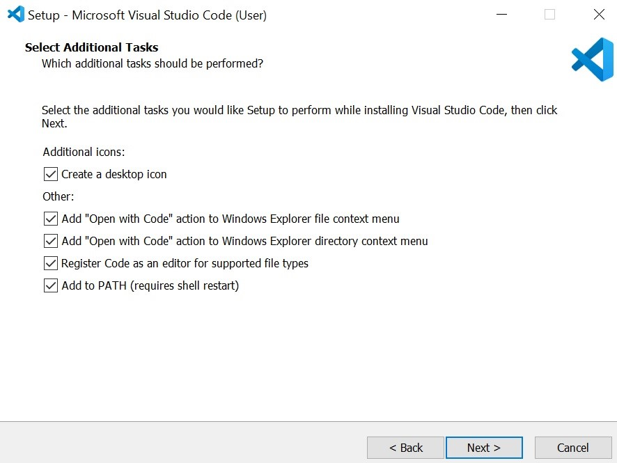
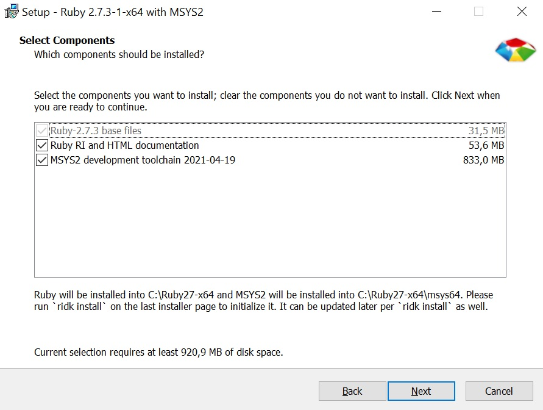
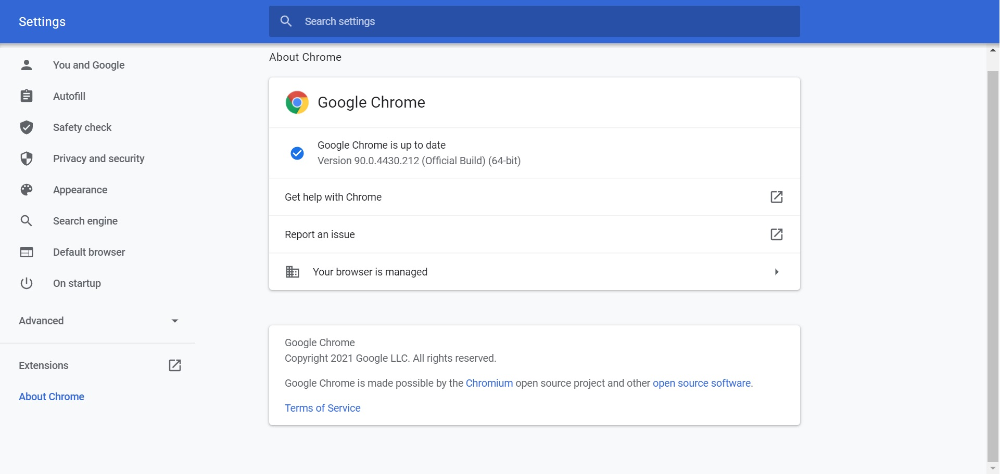
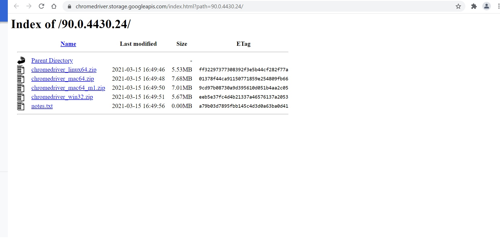
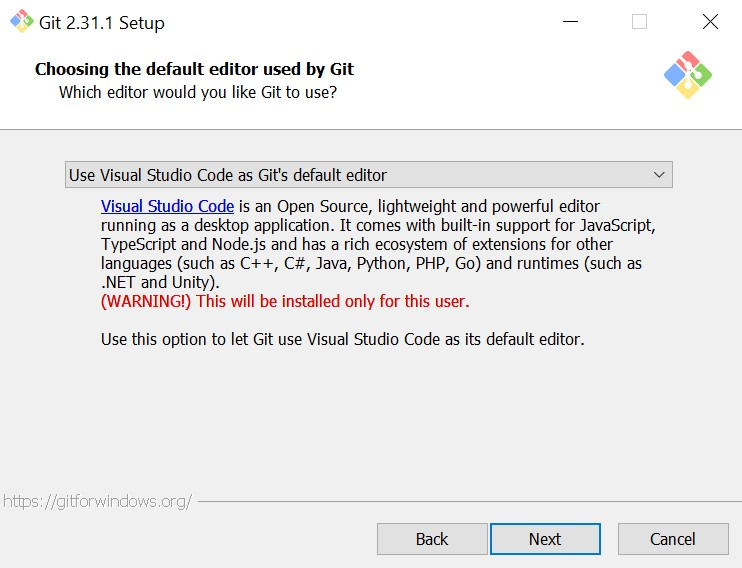
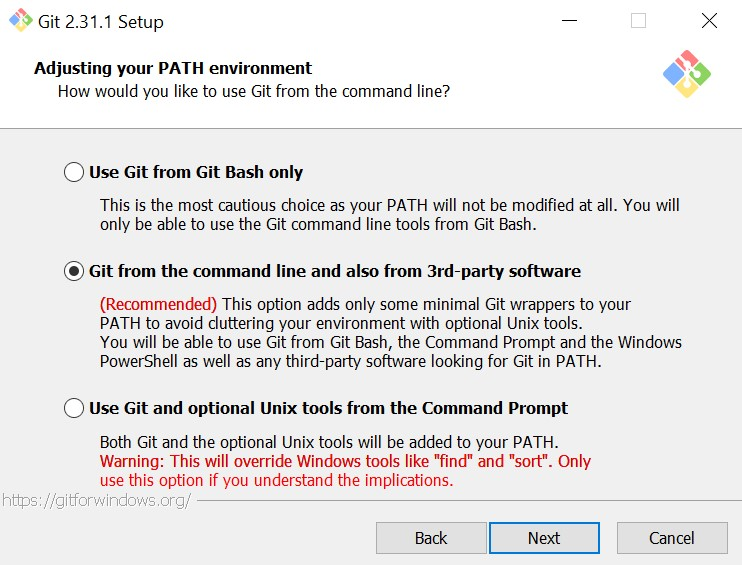
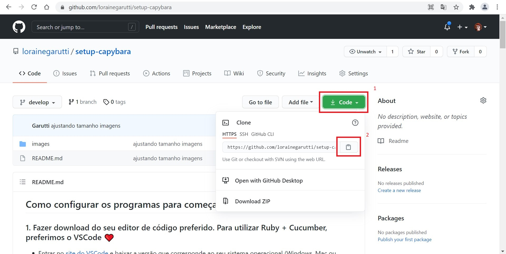
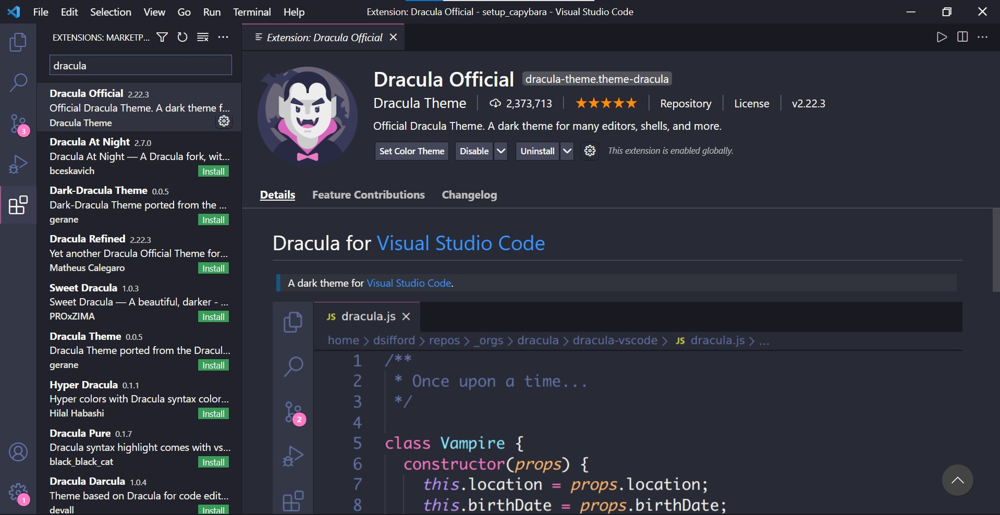

## Como configurar os programas para começar a escrever os testes?

### 1. Fazer download do seu editor de código preferido. Para utilizar Ruby + Cucumber, preferimos o VSCode ❤️

  - Entrar no [site do VSCode](https://code.visualstudio.com/) e baixar a versão que corresponde ao seu sistema operacional (Windows, Mac ou Linux);

  - Após o download, abrir o arquivo executável e escolher a pasta onde ele ficará.

  - Na etapa seguinte, uma sugestão boa é marcar as configurações adicionais de acordo com a imagem abaixo:

  <p align="center">
    
  </p>

  - É só finalizar a instalação e estaremos prontos para seguir!


### 2. Obter a distribuição do Ruby na versão mais estável. Para a instalação, siga os passos de acordo com seu sistema operacional 💾 

  * <b> Windows </b>: 

    - [Clicar neste link](https://rubyinstaller.org/downloads/) para baixar a versão mais estável do Ruby com devkit (atualmente é a 2.7.3), escolhendo 64 bits (versão x64) ou 32 bits (versão x86) de acordo com seu sistema operacional;

    - Abrir o arquivo executável, aceitar os termos, instalar de acordo com as configurações da imagem abaixo:

    <p align="center">
      
    </p>

    - Após concluir a instalação, será aberta uma janela do prompt de comando pedindo para que você digite um número. Digite 1 (para instalar a MSYS2) e clique em "Enter";

    - O próximo passo é verificar se a instalação foi concluída. Para isso, abra o prompt de comando. Se não souber onde fica, abra o menu inicial do Windows e digite as palavras "prompt de comando". O Windows vai te sugerir e poderá abrir. Com ele aberto, digite a palavra a seguir e clique em "Enter":

    ```
    ruby -v
    ```

    - Se o Ruby tiver sido instalado corretamente, o resultado esperado será algo parecido com a mensagem abaixo:

    ```
    ruby 2.7.3p183 (2021-04-05 revision 6847ee089d) [x64-mingw32]
    ```

  * <b> MacOS e Linux </b>: 

    - É aconselhável baixar a versão estável do Ruby através de um sistema de gerenciamento de pacotes, utilizaremos o RVM. [Clique aqui](http://rvm.io/rvm/install) para ver o passo a passo na documentação oficial. 

    - Vamos instalar o Homebrew, que é um gerenciador de pacotes para esses sistemas operacionais. [A documentação oficial em português está aqui](https://brew.sh/index_pt-br). Caso você tenha algum problema no Linux, [tente resolver aqui nesta página.](https://docs.brew.sh/Homebrew-on-Linux) Depois disso, abra o terminal e digite o comando abaixo e clique em "Enter" para instalar o Homebrew:

    ```
    /bin/bash -c "$(curl -fsSL https://raw.githubusercontent.com/Homebrew/install/HEAD/install.sh)"
    ```

    - Agora precisamos instalar o gpupg2, um software de criptografia, utilizado para instalar o RVM. No terminal, digite o comando abaixo e clique em "Enter":

    ```
    brew install gnupg
    ```

    - Ainda no terminal, digite o comando abaixo e clique em "Enter" para instalar as chaves de verificação:

    ```
    gpg --keyserver hkp://pool.sks-keyservers.net --recv-keys 409B6B1796C275462A1703113804BB82D39DC0E3 7D2BAF1CF37B13E2069D6956105BD0E739499BDB
    ```
    
    - Digite o comando abaixo no terminal e clique em "Enter" para baixar o RVM já com a versão estável do Ruby:

    ```
    \curl -sSL https://get.rvm.io | bash -s stable --ruby
    ```

    - O próximo passo é verificar se a instalação do RVM + Ruby foi concluída. Para isso, no terminal, digite o comando abaixo no terminal e clique em "Enter":

    ```
    rvm list
    ```
    
    - Se RVM + Ruby tiverem sido instalados corretamente, o resultado esperado será algo parecido com a mensagem abaixo:

    ```
    =* ruby 2.7.3 [ x86_64 ]
    ```

    - Para fixar a versão do Ruby que acabou de ser instalada, digite o comando abaixo no terminal e clique em "Enter":

    ```
    rvm use default 2.7
    ```

### 3. Instalar a gem do bundler para instalar todas as gems necessárias do projeto (para todos os sistemas operacionais) 💎

  - No terminal (MacOS e Linux) ou no prompt de comando (Windows), digite o comando abaixo e clique em "Enter":

  ```
  gem install bundler
  ```

  - A resposta deve ser parecida com a seguinte:

  ```
  Successfully installed bundler-2.2.17
  Parsing documentation for bundler-2.2.17
  Installing ri documentation for bundler-2.2.17
  Done installing documentation for bundler after 2 seconds
  1 gem installed
  ```

### 4. Fazer o download do chromedriver e como configurá-lo para conseguirmos manipular o Chrome através do Selenium 🚢

  - Ver qual versão do Chrome está instalada no seu computador. Para isso, dentro do navegador aberto, clique nos três pontinhos no canto superior direito e escolha "Configurações". Para ir direto, é só digitar o seguinte endereço no navegador:
  
  - A partir das configurações, clicar no canto inferior esquerdo "Sobre o Chrome". Para ir direto, é só digitar o seguinte endereço no navegador:
    
  ```
  chrome://settings/help
  ```
  <p align="center">
    
  </p>

  - Na imagem acima podemos ver que a versão instalada é a 90.0.4430.212;

  - Então precisamos [entrar na página do Chromedriver](https://chromedriver.chromium.org/downloads) e fazer o download da mesma versão que o Chrome já instalado no computador.

  - Depois de clicar em cima da versão que precisamos, podemos escolher o sistema operacional que estamos trabalhando para baixar: 

  <p align="center">
    
  </p>

  - Abrir a pasta que acabamos de baixar e:

    * No <b>Windows </b>: fazer a extração do arquivo executável dentro da pasta <b>C:\Windows</b>, porque ela já está exposta no PATH do Windows. 
    Para verificar se está visível corretamente, abra o prompt de comando e digite:

    ```
    where chromedriver
    ```

    A resposta deveria vir algo parecido com:

    ```
    C:\Windows\chromedriver.exe
    ```

    * No <b>MacOS ou Linux </b>: fazer a extração do arquivo executável dentro da pasta <b>/usr/local/bin/</b>, porque ela já está exposta no PATH do sistema operacional. Para verificar se está visível corretamente, abra o terminal e digite:

    ```
    where chromedriver
    ```

    A resposta deveria vir algo parecido com:

    ```
    /usr/local/bin/chromedriver
    ```
  
### 5. Vamos começar o setup do projeto! 🎬

  - Para facilitar, adicionamos esse repositório com as configurações básicas. Você precisa copiar ele para dar continuidade no seu computador. Para isso, usaremos o <b>Git</b>, um sistema de controle de versões.

    * No <b>Windows </b>: [entre no site oficial do Git e faça o download da versão para Windows](https://gitforwindows.org/). Após o download, clique duas vezes no arquivo executável e siga as instruções, clicando em "Next", até chegar na tela abaixo.     
      * Escolha Visual Studio Code (que já instalamos) como o editor principal dos comandos Git:

        <p align="center">
          
        </p>

      * Faça a configuração a seguir para o Git deixar a branch principal criada como "master":

        <p align="center">
          
        </p>

      * Escolha a segunda opção, como a imagem abaixo sugere, para utilizar os comandos do Git na linha de comando e adicionar somente as configurações principais como variáveis de ambiente automaticamente:

        <p align="center">
          
        </p>

      * Vá clicando em "Próximo" até começar a instalação.

    * No <b>Mac OS </b>: pode ser que você já tenha o Git instalado, para conferir, abra o terminal e digite o comando seguido de 'Enter':

      ```
      git --version
      ```
    
        * Caso já esteja instalado, o retorno será parecido com a mensagem a seguir:
      
      ```
      git version 2.31.1
      ```

        * Caso não esteja instalado, digite o comando seguido de 'Enter':
      
      ```
      brew install git
      ```

    * No <b>Linux </b>: [como tem várias distribuições Linux, acesse a página oficial para saber qual o melhor comando para seu caso](https://git-scm.com/download/linux). No geral, para Debian/Ubuntu, abra o terminal e digite o comando seguido de 'Enter':

      ```
      apt-get install git
      ```

  - No terminal (MacOS e Linux) ou no prompt de comando (Windows), digite os comandos abaixo seguidos por "Enter" para configurar o autor das ações feitas através do Git:

    ```
    git config --global user.name "João Silva"
    git config --global user.email "exemplo@seuemail.com.br"
    ```

  - Agora é hora de clonar esse repositório na sua máquina. Dentro da raiz https://github.com/lorainegarutti/setup-capybara, clique no botão destacado na imagem e depois no ícone de copiar o link:

    <p align="center">
      
    </p>

  - No terminal (MacOS e Linux) ou no prompt de comando (Windows), digite os comandos abaixo seguidos por "Enter" no lugar onde queremos colocar o projeto:

    ```
    git clone https://github.com/lorainegarutti/setup-capybara.git
    ```

  - Depois é só entrar na pasta que você acabou de criar:

    ```
    cd setup-capybara
    ```

  - E abrir esta pasta com o Visual Studio Code:

    ```
    code .
    ```
  
    * Ou: abra o Visual Studio Code e escolha a pasta "setup-cabypara".

### 6. O nosso projeto 👇

  - Pensaremos em cenários e automação de testes baseadas nas features do site: http://automationpractice.com/


### 7. Extensões do VSCode que vão facilitar nosso trabalho 📁

  - Com o VSCode aberto, no menu lateral esquerdo, clique no ícone para acessar as extensões (ou comando Ctrl+Shift+X) - imagem abaixo.

    <p align="center">
      
    </p>

  - Fazer a busca das extensões como indicado na imagem abaixo.

    <p align="center">
      
    </p>

    - Ruby 
      <br />(por Peng Lv)

    - Ruby Solargraph 
      <br />(por Castwide)

    - Cucumber (Gherkin) Full Support 
      <br />(por Alexander Krechik)

    - Snippets and Syntax Highlight for Gherkin (Cucumber)
      <br />(por Euclidity)

    - Gherkin Indent
      <br />(por Aavind Kumar)

    - vscode-icons

    - Dracula Official


### 8. Conteúdos extras!

  <b> Quer saber mais? </b>

  * Quer saber mais sobre o Git? Tem um curso gratuito disponibilizado pela [Test Automation University, clique aqui para saber mais.](https://testautomationu.applitools.com/git-tutorial/)


  <b> Links da apresentação </b>

  * Parte "Vamos automatizar tudo?": https://medium.com/assertqualityassurance/automatizar-testes-piora-a-qualidade-da-sua-entrega-89e312c4adbc

  * Parte "Vamos contruir?" referências de construção da escrita em Gherkin: https://docbehat.readthedocs.io/pt/v3.1/guides/1.gherkin.html#etapas

  * Parte "Vamos construir?" referências de boas práticas na construção de cenários: https://www.cloudbees.com/blog/cucumber-best-practices e https://spin.atomicobject.com/2011/06/02/never-say-click-good-cucumber-system-testing-practices/ 